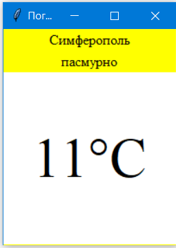

<p align="center">МИНИСТЕРСТВО НАУКИ  И ВЫСШЕГО ОБРАЗОВАНИЯ РОССИЙСКОЙ ФЕДЕРАЦИИ<br>
Федеральное государственное автономное образовательное учреждение высшего образования<br>
"КРЫМСКИЙ ФЕДЕРАЛЬНЫЙ УНИВЕРСИТЕТ им. В. И. ВЕРНАДСКОГО"<br>
ФИЗИКО-ТЕХНИЧЕСКИЙ ИНСТИТУТ<br>
Кафедра компьютерной инженерии и моделирования</p>

<br>

<h3 align="center">Отчёт по лабораторной работе № 1<br> по дисциплине "Программирование"</h3>
<br><br>

<p>студента 1 курса группы ПИ-б-о-202(2)<br>
Сулейманова Исы Руждиевича<br>
направления подготовки 09.03.04 "Программная инженерия"</p>

<br><br>

<table>
<tr><td>Научный руководитель<br> старший преподаватель кафедры<br> компьютерной инженерии и моделирования</td>
<td>(оценка)</td>
<td>Чабанов В.В.</td>
</tr>
</table>
<br><br>

<p align="center">Симферополь, 2020</p>
<hr>


## Цель:

1. Закрепить навыки разработки многофайловыx приложений;
2. Изучить способы работы с API web-сервиса;
3. Изучить процесс сериализации/десериализации данных в/из json;
4. Получить базовое представление о сетевом взаимодействии приложений;

## Постановка задачи
Разработать сервис предоставляющий данные о погоде в городе Симферополе на момент запроса. В качестве источника данных о погоде использовать: http://openweathermap.org/. В состав сервиса входит: серверное приложение на языке С++ и клиентское приложение на языке Python.
Серверное приложение (далее Сервер) предназначенное для обслуживания клиентских приложений и минимизации количества запросов к сервису openweathermap.org. Сервер должен обеспечивать возможность получения данных в формате JSON и виде html виджета (для вставки виджета на страницу будет использоваться iframe).
Клиентское приложение должно иметь графический интерфейс отображающий сведения о погоде и возможность обновления данных по требованию пользователя.

## Выполнение работы
Первым пунктом для нас будет создание API ключа. Для этого мы регистрируемся на сайте [openweathermap.org]() и во вкладке API keys создаём свой собственный ключ.

Созданный ключ: b522dba7cc25f5d20be8b87eda9ec768

Запрос созданный к серверу погоды: 	

/data/2.5/onecall?lat=44.952116&lon=34.102411&units=metric&exclude=current,minutely,daily,alerts&lang=ru&appid=b522dba7cc25f5d20be8b87eda9ec768

Запрос для сервера погоды:

http://worldtimeapi.org/api/timezone/Europe/Moscow.txt

 Полный код сервера:
```cpp
// Заголовочный файл с прототипами наших функций запросов. funcs1.h
#pragma once
#include <nlohmann/json.hpp>
using json = nlohmann::json;

json get_json();
json get_cache();
bool cache_json(json j);
json get_time();
json get_hour_forecast(const json& hourly);
void findAndReplaceAll(std::string& data, std::string toSearch, std::string replaceStr);

// Файл server.cpp
#include <iostream>
#include <iomanip>
#include <fstream>
#include <string>
#include <ctime>

#include <cpp_httplib/httplib.h>
#include <nlohmann/json.hpp>
#include "funcs1.h"

using json = nlohmann::json;
using namespace httplib;

void response(const Request& req, Response& res)
{
    json hour_forecast;
    json body;

        body = get_cache();
        if (body.empty())
        {
            body = get_json();
            if (!body["err"].is_null())
            {
                res.set_content(body["err"], "text/plain;charset=utf-8");
                return;
            }
            cache_json(body);
        }
        else if (!body["err"].is_null())
        {
            res.set_content(body, "text/json;charset=utf-8");
        }
        hour_forecast = get_hour_forecast(body["hourly"]);

    std::ifstream template_file("template.html");
    std::string site;
    getline(template_file, site, '\0');
    template_file.close();

    findAndReplaceAll(site, "{hourly[i].weather[0].description}",
        hour_forecast["weather"][0]["description"]);
    findAndReplaceAll(site, "{hourly[i].weather[0].icon}",
        hour_forecast["weather"][0]["icon"]);
    findAndReplaceAll(site, "{hourly[i].temp}",
        std::to_string(int(std::round(hour_forecast["temp"].get<double>()))));

    res.set_content(site, "text/html;charset=utf-8");
}

void responseraw(const Request& req, Response& res) {
    json hour_forecast;
    json body;
    body = get_cache();
    if (body.empty())
    {
        body = get_json();
        if (!body["err"].is_null())
        {
            res.set_content(body, "text/json;charset=utf-8");
            return;
        }
    }
    else if (!body["err"].is_null())
    {
        res.set_content(body, "text/json;charset=utf-8");
    }
    hour_forecast = get_hour_forecast(body["hourly"]);

    std::ifstream template_file("template.html");
    std::string site;
    getline(template_file, site, '\0');
    template_file.close();
    json out;
    out["temp"] = hour_forecast["temp"];
    out["description"] = hour_forecast["weather"][0]["description"];

    res.set_content(out.dump(), "text/json;charset=utf-8");
}

int main() {
    Server svr;
    svr.Get("/", response);
    svr.Get("/raw", responseraw);
    svr.listen("localhost", 3000);
}


// Файл c реализацией наших запросов. funcs.cpp
#include <fstream>
#include <cpp_httplib/httplib.h>
#include <nlohmann/json.hpp>
using json = nlohmann::json;
using namespace httplib;

Client owm("http://api.openweathermap.org");
Client time_srv("http://worldtimeapi.org");

json cache;

void findAndReplaceAll(std::string& data, std::string toSearch, std::string replaceStr) {
    size_t pos = data.find(toSearch);
    while (pos != std::string::npos) {
        data.replace(pos, toSearch.size(), replaceStr);
        pos = data.find(toSearch, pos + replaceStr.size());
    }
}

json get_json() {
    auto res = owm.Get("/data/2.5/onecall?lat=44.952116&lon=34.102411&units=metric&exclude=current,minutely,daily,alerts&lang=ru&appid=b522dba7cc25f5d20be8b87eda9ec768");
    if (!res) {
        return ("Err");
    }
    int status = res->status;
    if (status < 200 or status >= 300) {
        return ("Err");
    }
    return json::parse(res->body);
}

json get_cache() {
    if (!cache.empty())
    {
        return cache;
    }
    json cache;
    std::ifstream cache_file("cache.json");
    if (cache_file.is_open()) {
        std::string content;
        getline(cache_file, content, '\0');

        if (!content.empty()) {
            cache = json::parse(content);
        }
        cache_file.close();
    }
    else {
        return { "err", "Could not open `cache.json` to read cache." };
    }
    return cache;
}

bool cache_json(json j) {
    cache = j;
    std::ofstream cache_file("cache.json");
    if (cache_file.is_open()) {
        cache_file << j;
        cache_file.close();
    }
    else {
        return false;
    }
    return true;
}

json get_time() {
    auto time = time_srv.Get("/api/timezone/Europe/Simferopol");
    if (!time) {
        return("Err");
        return json::object();
    }
    int status = time->status;
    if (status < 200 or status >= 300) {
        return ("Err");
    }
    return json::parse(time->body);
}

json get_hour_forecast(const json& hourly) {
    json hour_forecast;

    int last = hourly.size() - 1;
    int current_time;
    json time_j = get_time();
    if (time_j["err"].is_null()) {
        current_time = time_j["unixtime"];
    }
    else {
        current_time = std::time(0);
    }

    if (hourly[last]["dt"] < current_time) {
        return json::object();
    }

    for (int i = 0; i <= last; ++i) {
        if (hourly[i]["dt"] >= current_time) {
            hour_forecast = hourly[i];
            break;
        }
    }
    return hour_forecast;
}
```

Исходный код клиента:
```python
from tkinter import *
import json
import requests

#Функция, запрашивающая значение температуры у сервера
def reload_data(event=None):
	try:
		response = requests.get('http://localhost:3000/raw').content.decode("utf8")
		forecast_j = json.loads(response)

		desc.config(text=str(forecast_j["description"]))
		temp.config(text=str(round(forecast_j["temp"])) + "°C")
	except requests.exceptions.ConnectionError:
		pass

root = Tk()
root.title("Погода")
root.pack_propagate(0)
root.bind("<Button-1>", reload_data)
root.geometry("200x250")

top_frame =    Frame(root, bg="yellow")
middle_frame = Frame(root, bg="white")
bottom_frame = Frame(root, bg="yellow")

top_frame.pack(fill=X)
middle_frame.pack(expand=True, fill=BOTH)
bottom_frame.pack(side=BOTTOM, fill=X)

city = Label(top_frame, font=("Times New Roman", 12), text="Симферополь", bg="yellow")
desc = Label(top_frame, font=("Times New Roman", 12), bg="yellow")
temp = Label(middle_frame, font=("Times New Roman", 48), bg="white")

city.pack(pady=0)
desc.pack(pady=0)
temp.pack(expand=True)

reload_data()
root.mainloop()

```




Рисунок 1. Клиент


Рисунок 2. Виджет


## Вывод по работе. 
Цель работы была успешно достигнута. Было выполнено:
- Создание сервера на языке С++, обращающегося к openweathermap.com и возвращающий виджет или описание и температуру в формате json
- Приложение с графическим интерфейсом, написанное на языке Python с использованием библиотеки Tkinter, получающее и обрабатывающее данные из сервера.
