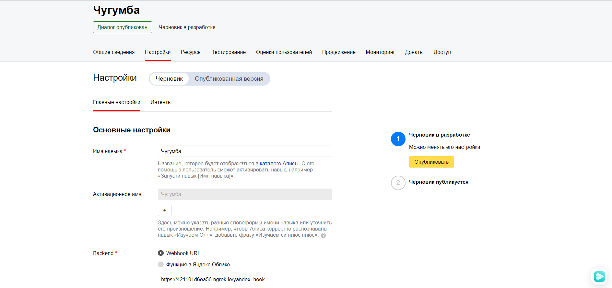
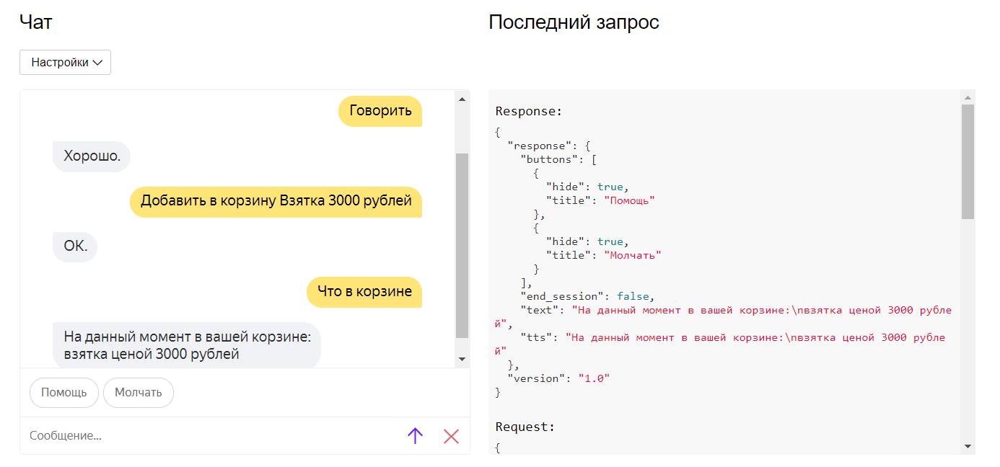
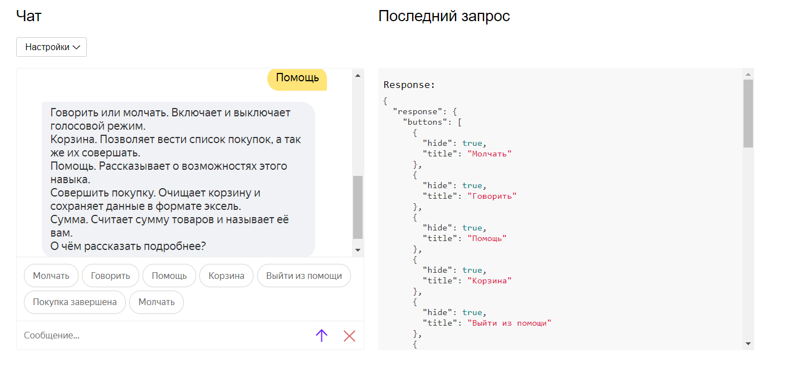

<p align="center">МИНИСТЕРСТВО НАУКИ  И ВЫСШЕГО ОБРАЗОВАНИЯ РОССИЙСКОЙ ФЕДЕРАЦИИ<br>
Федеральное государственное автономное образовательное учреждение высшего образования<br>
"КРЫМСКИЙ ФЕДЕРАЛЬНЫЙ УНИВЕРСИТЕТ им. В. И. ВЕРНАДСКОГО"<br>
ФИЗИКО-ТЕХНИЧЕСКИЙ ИНСТИТУТ<br>
Кафедра компьютерной инженерии и моделирования</p>

<br>

<h3 align="center">Отчёт по лабораторной работе № 2<br> по дисциплине "Программирование"</h3>

<br>

<br>

<p>студента 1 курса группы ПИ-б-о-202(2)<br>
Сулейманова Исы Руждиевича<br>
направления подготовки 09.03.04 "Программная инженерия"</p>

<br>

<br>

<table>
<tr><td>Научный руководитель<br> старший преподаватель кафедры<br> компьютерной инженерии и моделирования</td>
<td>(оценка)</td>
<td>Чабанов В.В.</td>
</tr>
</table>

<br>

<br>

<p align="center">Симферополь, 2020</p>
<hr>

## Цель

1. Получить представления о структуре post-запроса;
2. Изучить webhooks как метод взаимодействия web-приложений;

## Постановка задачи

Разработать и зарегистрировать навык для Алисы на сервисе Яндекс.Диалоги;

В качестве backend-a для навыка реализовать приложение на языке С++ выполняющее следующие функции:

- Составление продуктовой корзины:
  - Добавление продукта в корзину;
  - Удаление продукта из корзины;
  - Очистка корзины;
  - Вывод списка товаров в корзине;
  - Подсчёт стоимости товаров в корзине.
- Вывод справочной информации по навыку;
- Регистрацию webhook-ов сторонних сервисов;
- Отправку данных на сторонние сервисы.

В качестве стороннего сервиса реализовать приложение на языке Python, выполняющее следующие функции: Ожидание данных о покупке; Сохранение поступивших данных в excel-документ.

## Выполнение работы



Рисунок 1. Настройки навыка.

Далее была написана логика работы с диалогом Yandex.

В основном использовалось поле в запросе "command", которое содержит текст сообщения в нижнем регистре и очищенный от знаков препинания.



Рисунок 2. Диалог в обычном режиме.



Рисунок 3. Диалог в режиме помощи.

Веб-страница управления вебхуками генерируется простейшим образом. Для каждого вебхука из конфигурационного файла ссылка на вебхук заменяется в шаблоне для вебхука и добавляется в конец временной строки. После этой временной строкой заменяется место, предназначенное для списка вебхуков.


Рисунок 4. Скриншот панели управления вебхуками с готовой ссылкой ngrok для клиента.

Ссылка на файл excel: [data.xlsx](https://github.com/Pepsikolniy/Programming/blob/master/Labs/Lab2/Python/data.xlsx)

Исходный код на C++:

```c++
// Код сервера
#include <iostream>
#include <fstream>
#include <vector>

#include <cpp_httplib/httplib.h>
using namespace httplib;

void webhooks_get(const Request& req, Response& res);
void webhooks_post(const Request& req, Response& res);
void yandex_hook(const Request& req, Response& res);

int main()
{
	Server srv;

	srv.Get("/webhooks", webhooks_get);
	srv.Post("/webhooks", webhooks_post);
	srv.Post("/yandex_hook", yandex_hook);

	srv.listen("localhost", 1234);
}
// Код, генерирующий вебхуки
#include <iostream>
#include <fstream>
#include <vector>
#include <filesystem>
#include <cpp_httplib/httplib.h>
#include <nlohmann/json.hpp>

using json = nlohmann::json;
using namespace httplib;

json get_webhooks();
void save_webhooks(json config);
std::string gen_webhook_page();
void webhooks_post(const Request& req, Response& res);

const std::string config_file_name = "config.json";
const std::string webpage_file_name = "webhooks.html";
const std::string webhook_template = u8R"(
                    <div class="form-row align-items-center">
                      <div class="col">
                        <input type="text" value="{Webhook URL}" class="form-control mb-2" disabled>
                      </div>
                      <div class="col">
                        <button type="submit" name="del" value="{Webhook URL}" class="btn btn-danger mb-2">Удалить</button>
                      </div>
                    </div>)";

void findAndReplaceAll(std::string& data, std::string toSearch, std::string replaceStr)
{
	size_t pos = data.find(toSearch);
	while (pos != std::string::npos)
	{
		data.replace(pos, toSearch.size(), replaceStr);
		pos = data.find(toSearch, pos + replaceStr.size());
	}
}
json get_webhooks()
{
	std::ifstream config_file(config_file_name);
	json config;

	if (config_file.is_open())
	{
		config_file >> config;
		config_file.close();
	}

	return config;
}
void save_webhooks(json config)
{
	std::ofstream config_file(config_file_name);

	if (config_file.is_open())
	{
		config_file << config.dump(4);
		config_file.close();
	}
	else
	{
		std::cout << "Ошибка пути или прав доступа" << std::endl;
	}
}

std::string gen_webhook_page()
{
	std::ifstream webpage_file(webpage_file_name);
	std::string webpage;
	if (webpage_file.is_open())
	{
		std::getline(webpage_file, webpage, '\0');
		webpage_file.close();
	}

	else return "";
	json config = get_webhooks();
	if (!config["webhooks"].empty()) {
		for (auto weebs : config["webhooks"]) {
			int baran = webpage.find("{webhooks_list}") - 1;
			std::string templ = webhook_template;
			findAndReplaceAll(templ, "{Webhook URL}", weebs.get<std::string>());
			webpage.insert(webpage.begin() + baran, templ.begin(), templ.end());
		}
	}
	findAndReplaceAll(webpage, "{webhooks_list}", "");
	return webpage;
}

void webhooks_get(const Request& req, Response& res)
{
	res.set_content(gen_webhook_page(), "text/html; charset=UTF-8");
}

void webhooks_post(const Request& req, Response& res)
{
	json config = get_webhooks();
	if (req.has_param("del"))
	{
		std::string value = req.get_param_value("del");
		if (!config["webhooks"].empty())
		{
			for (auto ptr = config["webhooks"].begin(); ptr != config["webhooks"].end(); ++ptr)
			{
				if (ptr->is_string() && ptr->get<std::string>() == value)
				{
					config["webhooks"].erase(ptr);
					break;
				}
			}
		}
	}
	else if (req.has_param("set"))
	{
		std::string value = req.get_param_value("set");

		if (value == "")
		{
		}
		else
		{
			if (!config["webhooks"].empty())
			{
				bool found = false;
				for (auto ptr = config["webhooks"].begin(); ptr != config["webhooks"].end(); ++ptr)
				{
					if (ptr->is_string() && ptr->get<std::string>() == value)
					{
						found = true;
					}
				}
				if (!found) {
					config["webhooks"].push_back(value);
				}
			}
			else
			{
				config["webhooks"].push_back(value);
			}
		}
	}
	save_webhooks(config);
	res.set_content(gen_webhook_page(), "text/html; charset=UTF-8");
	std::cout << std::endl;
}
// Навык для Алисы
#include <iostream>
#include <fstream>
#include <vector>
#include <filesystem>

#include <cpp_httplib/httplib.h>
#include <nlohmann/json.hpp>

using json = nlohmann::json;
using namespace httplib;
json get_webhooks();

enum voice_mode
{
	silent_mode,
	speak_mode
};
enum skill_mode
{
	default_mode,
	help_mode
};
json session_list = json::array();
json default_state_buttons =
{
	{
		{"title", u8"Помощь"},
		{"hide", true}
	},
};
json speak_mode_button =
{
	{"title", u8"Говорить"},
	{"hide", true}
};
json silent_mode_button =
{
	{"title", u8"Молчать"},
	{"hide", true}
};

json help_state_buttons =
{
	{
		{"title", u8"Молчать"},
		{"hide", true}
	},
	{
		{"title", u8"Говорить"},
		{"hide", true}
	},
	{
		{"title", u8"Помощь"},
		{"hide", true}
	},
	{
		{"title", u8"Корзина"},
		{"hide", true}
	},
	{
		{"title", u8"Выйти из помощи"},
		{"hide", true}
	},
	{
		{"title", u8"Покупка завершена"},
		{"hide", true}
	},
};

json gen_response(const std::string& text,
	const std::string& tts,
	const json& buttons,
	const json* current_session = nullptr,
	const bool end_session = false)
{
	json response = {
		{"response", {
			{"buttons", buttons},
			{"end_session", end_session}
		}},
		{"version", "1.0"}
	};
	if (text != "")
	{
		response["response"]["text"] = text;
	}
	if (current_session != nullptr && (*current_session)["voice_mode"] == speak_mode)
	{
		if (tts != "")
		{
			response["response"]["tts"] = tts;
		}
		response["response"]["buttons"].push_back(silent_mode_button);
	}
	else if (current_session != nullptr && (*current_session)["voice_mode"] == silent_mode)
	{
		response["response"]["buttons"].push_back(speak_mode_button);
	}
	return response;
}

void yandex_hook(const Request& req, Response& res)
{
	json req_json = json::parse(req.body);

	std::string user_id = req_json["session"]["application"]["application_id"];
	json response;
	json* cur_session = nullptr;

	for (auto& session : session_list)
	{
		if (session["user_id"] == user_id)
		{
			cur_session = &session;
			break;
		}
	}

	if (req_json["session"]["new"].get<bool>())
	{
		if (cur_session == nullptr)
		{
			json session =
			{
				{"user_id", user_id},
				{"skill_mode", default_mode},
				{"voice_mode", silent_mode},
				{"cart", json::array()}
			};
			// Сессия новая, добавляем её в сессии.
			session_list.push_back(session);
			cur_session = &session_list[session_list.size() - 1];
		}
		else
		{
			(*cur_session)["skill_mode"] = default_mode;
			(*cur_session)["voice_mode"] = silent_mode;
		}

		json response = gen_response(
			u8"Здравствуйте! Я помогу вам с покупками.",
			u8"Здр+авствуйте! Я помог+у вам с пок+упками.",
			default_state_buttons,
			cur_session);

		res.set_content(response.dump(2), "text/json; charset=UTF-8");
		return;
	}

	if (cur_session == nullptr)
	{
		json response = gen_response(
			u8"Извините, произошла ошибка",
			u8"Извин+ите, произошл+а ош+ибка",
			default_state_buttons,
			cur_session,
			true);
		res.set_content(response.dump(2), "text/json; charset=UTF-8");
		return;
	}

	std::string command = req_json["request"]["command"];
	if ((*cur_session)["skill_mode"] == help_mode)
	{
		// молчать, говорить, помощь, корзина, выйти из помощи, покупка завершена, сумма
		// О чём ещё рассказать?
		std::string text;
		std::string tts;

		if (command == u8"молчать")
		{
			text = u8"Скажите мне эту фразу и я не буду озвучивать свои сообщения.";
			tts = u8"Скажите мне эту фразу и я не буду озвучивать свои сообщения.";
		}
		else if (command == u8"говорить")
		{
			text = u8"Скажите мне говорить и я буду озвучивать все свои реплики";
			tts = u8"Скажите мне говорить и я буду озвучивать все свои реплики";
		}
		else if (command == u8"помощь")
		{
			text = u8"Это то, где вы сейчас находитесь. "
				u8"В этом режиме я расскажу вам подробно о своих возможностях.";
			tts = u8"Это то, где вы сейчас находитесь. "
				u8"В этом режиме я расскажу вам подробно о своих возможностях.";
		}
		else if (command == u8"корзина")
		{
			text = u8"Я запомню, что вы будете добавлять или удалять из корзины.\n"
				u8"Чтобы добавить что-то, скажите \"Добавить в корзину сыр 5 рублей\".\n"
				u8"Чтобы удалить что-то, скажите \"Удалить из корзины сыр\".";
			tts = u8"Я запомню, что вы будете добавлять или удалять из корзины.\n"
				u8"Чтобы добавить что-то, скажите \"Добавить в корзину сыр 5 рублей\".\n"
				u8"Чтобы удалить что-то, скажите \"Удалить из корзины сыр\".";
		}
		else if (command == u8"сумма")
		{
			text = u8"Я подсчитаю стоимость всех товаров в вашей корзине и назову их общую стоимость.";
			tts = u8"Я подсчитаю стоимость всех товаров в вашей корзине и назову их общую стоимость.";
		}
		else if (command == u8"покупка завершена")
		{
			text = u8"Я передам список ваших покупок веб-хукам, после чего очищу корзину.";
			tts = u8"Я передам список ваших покупок веб-хукам, после чего очищу корзину.";
		}
		else if (command == u8"выйти из помощи")
		{
			text = u8"Выхожу. Нужна будет помощь - обращайтесь.";
			tts = u8"Выхожу. Нужна будет помощь - обращайтесь.";
			(*cur_session)["skill_mode"] = default_mode;
		}
		else
		{
			text = u8"С этим я не могу вам помочь.";
			tts = u8"С +этим я не мог+у вам пом+очь.";
		}

		json response;
		if ((*cur_session)["skill_mode"] == help_mode)
		{
			response = gen_response(text, tts, help_state_buttons, cur_session);
		}
		else
		{
			response = gen_response(text, tts, default_state_buttons, cur_session);
		}
		res.set_content(response.dump(2), "text/json; charset=UTF-8");
	}
	else
	{
		if (command == u8"молчать")
		{
			std::string text = u8"Молчу, молчу";
			std::string tts;
			(*cur_session)["voice_mode"] = silent_mode;
			json response = gen_response(
				text,
				tts,
				default_state_buttons,
				cur_session);
			res.set_content(response.dump(2), "text/json; charset=UTF-8");
		}
		else if (command == u8"говорить")
		{
			std::string text = u8"Хорошо.";
			std::string tts = u8"Хорош+о.";
			(*cur_session)["voice_mode"] = speak_mode;
			json response = gen_response(
				text,
				tts,
				default_state_buttons,
				cur_session);
			res.set_content(response.dump(2), "text/json; charset=UTF-8");
		}
		else if (command == u8"помощь")
		{
			std::string text =
				u8"Говорить или молчать. Включает и выключает голосовой режим.\n"
				u8"Корзина. Позволяет вести список покупок, а так же их совершать.\n"
				u8"Помощь. Рассказывает о возможностях этого навыка.\n"
				u8"Совершить покупку. Очищает корзину и сохраняет данные в формате эксель.\n"
				u8"Сумма. Считает сумму товаров и называет её вам.\n"
				u8"О чём рассказать подробнее?";
			std::string tts =
				u8"Говорить или молчать. Включает и выключает голосовой режим.\n"
				u8"Корзина. Позволяет вести список покупок, а так же их совершать.\n"
				u8"Помощь. Рассказывает о возможностях этого навыка.\n"
				u8"Совершить покупку. Очищает корзину и сохраняет данные в формате эксель.\n"
				u8"Сумма. Считает сумму товаров и называет её вам.\n"
				u8"О чём рассказать подробнее?";
			json response = gen_response(
				text,
				tts,
				help_state_buttons,
				cur_session);
			(*cur_session)["skill_mode"] = help_mode;
			res.set_content(response.dump(2), "text/json; charset=UTF-8");
		}
		else if (command == u8"очистить корзину")
		{
			std::string text = u8"Корзина пуста.";
			std::string tts = u8"Кориз+ина пуст+а.";
			json response = gen_response(
				text,
				tts,
				default_state_buttons,
				cur_session);
			(*cur_session).erase("cart");
			(*cur_session)["cart"] = json::array();
			res.set_content(response.dump(2), "text/json; charset=UTF-8");
		}
		else if (command == u8"что в корзине")
		{
			std::cout << "cart: " << (*cur_session)["cart"] << std::endl;

			std::string text;
			std::string tts;

			if ((*cur_session)["cart"].empty())
			{
				text = u8"На данный момент ваша корзина пуста.";
				tts = u8"На данный момент ваша корзина пуста.";
			}
			else
			{
				text = u8"На данный момент в вашей корзине:";
				for (auto& elem : (*cur_session)["cart"])
				{
					int price = elem["price"].get<int>();

					text += "\n"
						+ elem["item"].get<std::string>()
						+ u8" ценой "
						+ std::to_string(price);

					if (price % 10 == 0)
					{
						text += u8" рублей,";
					}
					else if (price % 10 == 1)
					{
						text += u8" рубль,";
					}
					else if (price % 10 < 5 && price % 10 > 0)
					{
						text += u8" рубля,";
					}
					else
					{
						text += u8" рублей,";
					}
				}
				text.pop_back();
				tts = text;
			}

			json response = gen_response(
				text,
				tts,
				default_state_buttons,
				cur_session);
			res.set_content(response.dump(2), "text/json; charset=UTF-8");
		}
		else if (command == u8"покупка завершена")
		{
			std::string text = u8"Заходите ещё!";
			std::string tts = u8"Заход+ите ещ+ё!";

			json output =
			{
				{"user_id", user_id},
				{"cart", (*cur_session)["cart"]}
			};

			json config = get_webhooks();

			for (std::string link : config["webhooks"])
			{
				std::cout << "link " << link << std::endl;
				int index = link.find('/', static_cast<std::string>("https://").size());

				std::cout << (index == std::string::npos) << std::endl;
				std::cout << (link.find("http://") == 0) << std::endl;
				std::cout << (link.find("https://") == 0) << std::endl;

				if (index != -1)
				{
					std::cout << link.substr(0, index).c_str() << std::endl;
					std::cout << link.substr(index, link.size()).c_str() << std::endl;
				}

				if (index == std::string::npos) // || link.find("http://") == 0 || link.find("https://") == 0)
				{
					std::cout << "bad link " << link << std::endl;
				}
				else
				{
					std::cout << link.substr(0, index).c_str() << std::endl;
					std::cout << link.substr(index, link.size()).c_str() << std::endl;
					Client cli(link.substr(0, index).c_str());
					cli.Post(link.substr(index, -1).c_str(), output.dump(2), "application/json; charset=UTF-8");
				}
			}

			(*cur_session).erase("cart");
			(*cur_session)["cart"] = json::array();

			json response = gen_response(
				text,
				tts,
				default_state_buttons,
				cur_session,
				true);
			res.set_content(response.dump(2), "text/json; charset=UTF-8");
		}
		else if (command == u8"сумма")
		{
			std::string text = "";
			std::string tts = "";

			size_t size = req_json["request"]["nlu"]["tokens"].size();
			int sum = 0;
			for (auto& cart_item : (*cur_session)["cart"])
			{
				sum += cart_item["price"].get<int>();
			}
			if (sum == 0)
			{
				text = u8"У вас в корзине нет товаров.";
				tts = u8"У вас в корз+ине нет тов+аров.";
			}
			else
			{
				text = u8"В общей сумме у вас товаров на " + std::to_string(sum);
				tts = u8"В +общей с+умме у вас тов+аров на " + std::to_string(sum);
				if (sum % 10 == 0)
				{
					text += u8" рублей.";
					tts += u8" рубл+ей.";
				}
				else if (sum % 10 == 1)
				{
					text += u8" рубль.";
					tts += u8" рубль.";
				}
				else if (sum % 10 < 5 && sum % 10 > 0)
				{
					text += u8" рубля.";
					tts += u8" рубл+я.";
				}
				else
				{
					text += u8" рублей.";
					tts += u8" рубл+ей.";
				}
			}

			json response = gen_response(
				text,
				tts,
				default_state_buttons,
				cur_session);
			res.set_content(response.dump(2), "text/json; charset=UTF-8");
		}
		else if (command.find(u8"добавить в корзину") == 0 || command.find(u8"добавь в корзину") == 0)
		{
			size_t size = req_json["request"]["nlu"]["tokens"].size();
			std::string text = u8"ОК.";
			std::string tts = u8"Ок+ей.";
			std::string item_name;
			int			item_price = 0;
			int			number_index = 0;
			bool			number_index_set = false;

			for (auto entity : req_json["request"]["nlu"]["entities"])
			{
				if (entity["type"].get<std::string>() == "YANDEX.NUMBER")
				{
					number_index = entity["tokens"]["start"];
					std::cout << entity["value"].type_name() << std::endl;
					int val = entity["value"];
					std::cout << u8"Инфо: цена " << val << std::endl;
					if (val < 0)
					{
						text = u8"Цена не может быть отрицательной.";
						tts = u8"Цен+а не м+ожет б+ыть отриц+ательной.";
					}
					else if (val == 0)
					{
						text = u8"Ну кто же вам продаст что-то за бесплатно?";
						tts = u8"Ну кто же вам прод+аст чт+о то за беспл+атно?";
					}
					else
					{
						item_price = val;
					}
					number_index_set = true;
					break;
				}
			}
			if (size == 3)
			{
				text = u8"Пожалуйста, расскажите, что добавить в корзину.";
				tts = u8"Пож+алуйста, расскаж+ите, что доб+авить в корз+ину.";
			}
			else if (!number_index_set)
			{
				text = u8"Пожалуйста, укажите цену товару.";
				tts = u8"Пож+алуйста, укаж+ите ц+ену тов+ару.";
			}
			else if (number_index == 3)
			{
				text = u8"Покажуйста, укажите название товара.";
				tts = u8"Пож+алуйста, укаж+ите назв+ание тов+ара.";
			}
			else
			{
				for (int i = 3; i < number_index; ++i)
				{
					item_name += req_json["request"]["nlu"]["tokens"][i].get<std::string>();
					item_name += " ";
				}
				item_name.pop_back();
				json item = {
					{"item",  item_name},
					{"price", item_price}
				};
				(*cur_session)["cart"].push_back(item);
			}

			json response = gen_response(
				text,
				tts,
				default_state_buttons,
				cur_session);

			res.set_content(response.dump(2), "text/json; charset=UTF-8");
		}
		else if (command.find(u8"удалить из корзины") == 0 || command.find(u8"удали из корзины") == 0
			|| command.find(u8"убрать из корзины") == 0 || command.find(u8"убери из корзины") == 0)
		{
			std::cout << (*cur_session)["cart"] << std::endl;
			size_t size = req_json["request"]["nlu"]["tokens"].size();

			std::string text;
			std::string tts;
			std::string item_name = "";

			for (int i = 3; i < size; ++i)
			{
				std::cout << req_json["request"]["nlu"]["tokens"][i].get<std::string>() << std::endl;
				item_name += req_json["request"]["nlu"]["tokens"][i].get<std::string>();
				item_name += " ";
			}
			bool found_item = false;
			int	item_index = 0;

			if (item_name == "")
			{
				text = u8"Ну вы хоть скажите, что собираетесь убирать.";
				tts = u8"Ну вы хоть скаж+ите, что собир+аетесь убир+ать.";
			}
			else
			{
				item_name.pop_back();
				for (auto& cart_item : (*cur_session)["cart"])
				{
					if (cart_item["item"].get<std::string>() == item_name)
					{
						found_item = true;
						break;
					}
					++item_index;
				}
				if (!found_item)
				{
					std::cout << u8"Инфо: такой предмет не был найден" << std::endl;
					text = u8"Такого в вашей корзине нету";
					tts = u8"Так+ого в в+ашей корз+ине н+ету.";
				}
				else
				{
					std::cout << u8"Инфо: Нашли такой предмет" << std::endl;
					text = u8"Удалила.";
					tts = u8"Удал+ила";
					(*cur_session)["cart"].erase((*cur_session)["cart"].begin() + item_index);
					std::cout << u8"Инфо: Удалили предмет" << std::endl;
				}
			}
			json response = gen_response(
				text,
				tts,
				default_state_buttons,
				cur_session);
			res.set_content(response.dump(2), "text/json; charset=UTF-8");
		}
		else
		{
			std::string text = u8"Я не знаю такую команду.";
			std::string tts = u8"Я не зн+аю так+ую ком+анду.";

			json response = gen_response(
				text,
				tts,
				default_state_buttons,
				cur_session);

			res.set_content(response.dump(2), "text/json; charset=UTF-8");
		}
	}
	std::cout << std::endl;
}
```

Исходный код Python:

```python
import openpyxl
import datetime
import json
import os.path
from flask import Flask, request

def writeexel():
    global line, buffer
    book = openpyxl.load_workbook('data.xlsx')
    sheet= book.active
    for items in buffer:
        for i in range(5):
            sheet.cell(line,i+1).value = items[i]
        line+=1
    sheet.cell(1,6).value = line-1
    book.save('data.xlsx')
    book.close
    buffer.clear()
    
app = Flask(__name__)  
@app.route('/', methods = ['POST', 'GET'])
def index():
    if request.method == 'POST':
        time = datetime.datetime.now().time()
        json_from_post= request.get_json()
        global number, buffer
        for item in json_from_post['cart']:
            buy = [number, json_from_post['user_id'], time, item['item'], item['price']]
            number += 1  
            buffer.append(buy)
        if len(buffer)>5:
            writeexel()
        return 'OK'
    
if __name__ == "__main__":
    global number, buffer, line
    number = 1
    line = 2
    buffer = []
    if not(os.path.exists('data.xlsx')):    
        book = openpyxl.Workbook()
        sheet = book.active
        sheet.cell(1,1).value = 'N'
        sheet.cell(1,2).value = 'User ID'
        sheet.cell(1,3).value = 'Datetime'
        sheet.cell(1,4).value = 'Item'
        sheet.cell(1,5).value = 'Price'
        sheet.cell(1,6).value = 1
        book.save('data.xlsx')
        book.close
    else:
        book = openpyxl.load_workbook('data.xlsx')
        sheet = book.active
        number = sheet.cell(1,6).value
        book.close
    app.run()

```

## Вывод

Изучил новое понятие POST-запроса. Изучил webhooks. Научился работать с системой навыков Яндекс, читать и записывать exel файлы с помощью Python.

